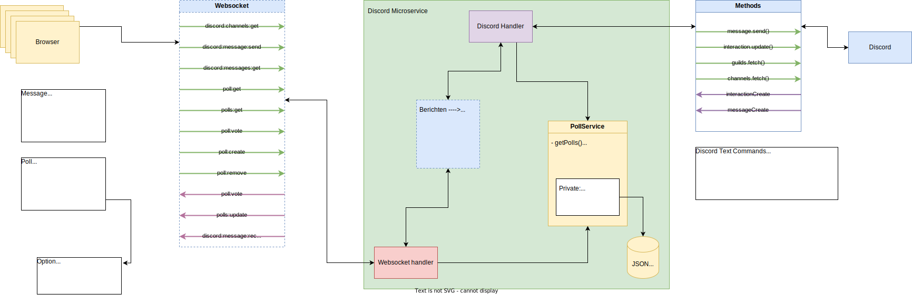

# Realtime web project

## Project

This project is a realtime web application made for school.
It is a website written in SvelteKit and Tailwind CSS (I'm sorry) that connects to a backend written in NodeJS using Socket.io and Express.js.
The backend listens for incoming websocket connections and handles any incoming messages from clients.
In addition to that the backend also connects to a Discord server as a bot and offers the same functionality there as on the website.
Clients on the website can speak to people on the Discord server through the bot and the people on the Discord server can speak using their normal chat interface to the people connected to the webclient.

Lastly, there is also a realtime poll system.
Polls can be created through Discord and are visible on both the website and Discord.
They can also be interacted with through both the webclient and Discord in realtime.

### MoSCoW

TODO:::

## Installation

To install this project, you need to run two applications: the frontend and the backend.

### Backend

Inside of the `discord-ms` directory, create a `.env` file that contains a variable `DISCORD_TOKEN` which is your Discord token.
After creating that, run `npm install` followed by `npm run dev` and the project will start.

### Frontend

Inside of the `frontend-ms` directory, simply run `npm install` and `npm run dev` to run the project.

## Communication

Communication between client and server is done via WebSockets.
When the client sends a message to the server, the server is meant to reply in a certain way, but always with at least an "Ack" response message.
An "Ack" or acknowledge is an object that looks like this:

```json
{
	"status": "ok / error",
	"error": "possible error message"
}
```

Various functions can include other fields.
One such is `discord:messages:get` which, along with the default `status` and optionally `error` fields, contains a `messages` field which is populated with messages.

### Messages from server to client (browser)

* `poll:vote`
	This is used to send updates of poll votes to connected clients.
	When a client votes on a poll, this is sent to all connected clients including the voting client, to tell the client to update the web interface.
* `discord:message:received`
	This is sent from the server when a Discord message is received and it tells the clients to update the interface with the newly sent message.
  
### Messages from client (browser) to server

The client makes use of both acknowledge callback functions to obtain data that it asked for, such as asking for the available channels.
However, when the client does something that all other connected clients need to also get (like sending a message or voting on a poll) the acknowledge callback does not contain the appropriate data, but instead only a status "ok" or "error" and a possible error message.
This is to simplify the communication, since broadcast messages do not have to be treated specially this way.

* `discord:channels:get`
	This asks the server to send all of the available Discord channels.
	The response is a callback function of the `ChannelResponse` object, which is a custom response similar to the "Ack" response detailed above.
* `discord:message:send`
  This tells the server to send a message from this client.
	The call includes a `message` field and a `channel_id` field.
	The `channel_id` is populated with the Discord channel ID to send the message to, which is a globally unique ID made by Discord for a channel.
	The `message` field is just a string.
	This message expects a callback with an acknowledge.
* `discord:messages:get`
  This tells the server to send the client the discord messages for the included `channel_id` which is sent along with this call.
	The callback function for this call contains a `MessageResponse` which is an acknowledge which includes an array of `Message` types.
* `poll:get`
  This tells the server to send the details of a poll.
	The poll it wants is specified with the `id` field included in this call, which corresponds to a poll ID.
	The response is a callback with `PollResponse` as the type.
	This is an acknowledge that includes a singular `Poll` object.
* `polls:get`
  Simply the plural version of the `poll:get` call.
	Doesn't include any fields with the call and the server will return every single poll it knows.
	The returned value in the callback is a `PollResponse`, same as above, but instead of a singular `Poll` it includes an array of `Poll` objects in the field `polls`.
* `poll:vote`
  This tells the server to vote on a poll.
	The included fields are `id` for the poll's ID and a string containing the option to vote on.
	Returned is a generic acknowledge object.

### Communication with Discord

The communication with Discord is handled through the Discord.js library for NodeJS.
I have put the entire logic for the Discord bot inside the `discord.js` file located in `/src` and put it inside of a class to make it managable.
This is done to separate code and make it less of a mess.
The Discord object is created inside of `index.js` and passed through to the `messageHandler` function which handles all of the websocket communication.

## Database

The "database" for this project is a json file created by the backend and saved there as well.
This is because there wasn't much time and this was the fastest solution.
Even though it isn't a real database, I will continue to call it that.

The database logic is handled inside of `pollService.js` through a class.
This class is very much stateless and simply provides the logic for getting data and creating it inside of the JSON file.
The fact that it is stateless means you can create as many instances of it as you want, it will write to the same file.

Q: Is there any protection against race conditions when two instances try to write at the same time?  
A: idk

### Data model / lifecycle

The database only stores polls, not messages.
Messages are already stored inside of Discord and persist there, so there is no reason to save those.

A poll is a Javascript object with the following (Typescript) specification:

```ts
interface Option {
	title: string,
	votes: number,
}

interface Poll {
	id: string,
	title: string,
	description: string,
	options: Option[],
}
```

When a poll gets created through Discord, the Discord bot first handles the command and tells the `pollService` to create a poll, adding it to the database.

When a user votes on the poll inside Discord, the Discord bot handles that request and then again tells the `pollService` to add a vote.
This is done by obtaining the poll, the option and then adding 1 to the total for that option and then saving it to the database again.

This communication is incredibly straightforward, it's just instructions and execution of simple instructions.

The data lifecycle is roughly the same for the webinterface part of the backend.
When the appropriate instruction gets called, the data is called or sent and then saved.

The most interesting data lifecycle is through Discord.
The data is sent by propagation, meaning that when a message is sent on either end (Discord or the web interface) this is handled by the Discord handler or the `messageHandler` and sent through to the other side.
When a Discord user sends a message this is handled and sent directly from the Discord handler to the client via a socket broadcast.

Here is a diagram:


